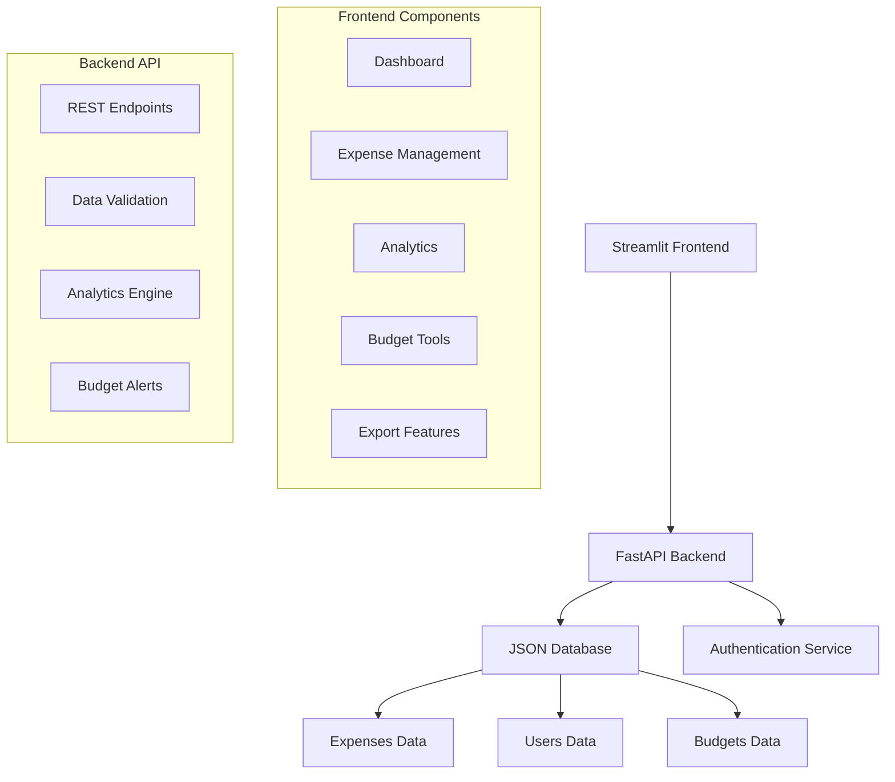

# EXPENSE TRACKER
[](https://fastapi.tiangolo.com/)
[](https://streamlit.io/)
[](https://python.org/)
[](https://render.com/)

A comprehensive expense tracking web application built for students and professionals to manage finances effectively. Features include real-time analytics, budget alerts, multi-user support, and detailed financial reporting - all optimized for the Indian economy (INR).

<p align="center">
  <a href="https://expense-tracker-analytics.streamlit.app/" target="_blank" rel="noopener noreferrer">
    
  </a>
</p>


## 📋 Table of Contents
- [✨ Features](#-features)
- [🖥️ Live Demo](#️-live-demo)
- [🏗️ Architecture](#️-architecture)
- [⚙️ Installation](#️-installation)
- [🚀 Deployment](#-deployment)
- [📊 Usage Guide](#-usage-guide)
- [🔧 Configuration](#-configuration)
- [🧪 API Documentation](#-api-documentation)
- [📁 Project Structure](#-project-structure)
- [🤝 Contributing](#-contributing)


## ✨ Features

### 💰 Core Functionality
- **Expense Management**: Add, edit, delete, and categorize expenses with priority levels
- **Multi-User Support**: Individual user accounts with phone-based authentication
- **Budget Tracking**: Set category-wise budgets with real-time alerts
- **Advanced Analytics**: Visual spending patterns, trends, and financial health scores
- **Data Export**: Export expenses as JSON or CSV for offline analysis

### 📈 Advanced Analytics
- **Spending Breakdown**: Category-wise, daily, and monthly analysis
- **Trend Analysis**: Weekly comparisons and spending velocity tracking
- **Financial Health Score**: Gauge your financial discipline
- **Priority Distribution**: Analyze essential vs discretionary spending
- **Savings Rate Calculation**: Monitor your saving habits

### 🔐 Security & User Management
- **Secure Authentication**: 6-digit PIN-based authentication
- **Admin Features**: Database export with admin code protection
- **Password Recovery**: Secure password reset functionality
- **User Isolation**: Each user sees only their own data

### 🌐 Technical Features
- **Responsive Design**: Works on desktop, tablet, and mobile
- **Real-time Updates**: Instant reflection of changes across all views
- **Sample Data Generation**: Get started instantly with realistic sample data
- **RESTful API**: Well-documented backend API for integrations

## 🖥️ Live Demo

**View my live project**: [Expense Tracker Pro](https://expense-tracker-analytics.streamlit.app/)

*Note: The application may take a few seconds to spin up on the free Render tier.*

## 🏗️ Architecture



## ⚙️ Installation

### Prerequisites
- Python 3.8 or higher
- pip (Python package manager)
- Git

### Local Development Setup

1. **Clone the repository**
```bash
git clone https://github.com/yourusername/expense-tracker-pro.git
cd expense-tracker-pro
```

2. **Install dependencies**
```bash
pip install -r requirements.txt
```

3. **Start the backend server**
```bash
python backend.py
```
The backend will be available at `http://localhost:8000`

4. **Start the frontend application**
```bash
streamlit run frontend.py
```
The frontend will be available at `http://localhost:8501`

5. **Access the application**
Open your browser and navigate to `http://localhost:8501`

## 🚀 Deployment

### Deploy on Render (Recommended)

1. **Fork or upload** this repository to your GitHub account
2. **Sign up** for a free account at [Render.com](https://render.com)
3. **Create a new Web Service** and connect your GitHub repository
4. **Use the `render.yaml` configuration** (included in the repository)
5. **Deploy** - Render will automatically deploy both frontend and backend

The `render.yaml` file configures:
- **Backend Service**: FastAPI application on port 8000
- **Frontend Service**: Streamlit application on port 8501
- **Service Discovery**: Automatic URL configuration between services

## 📊 Usage Guide

### Getting Started
1. **Create an account** using your phone number and a 6-digit PIN
2. **Add your first expense** or initialize sample data
3. **Set up budgets** for different spending categories
4. **Explore analytics** to understand your spending patterns

### Key Features Explained

#### 📋 Expense Management
- Add expenses with descriptions, amounts, categories, and priorities
- Tag expenses for better organization (e.g., "business", "personal", "emergency")
- Filter expenses by date, amount, category, or tags
- Edit or delete expenses as needed

#### 📈 Dashboard
- Real-time overview of your financial status
- Visual charts showing spending by category and time period
- Key metrics: Total spent, daily average, savings rate
- Top 10 largest expenses for quick review

#### 💰 Budget Management
- Set monthly budgets for each spending category
- Receive alerts when approaching or exceeding budgets
- Three alert levels: Info, Warning, and Critical
- Default budgets optimized for Indian student lifestyle

#### 🔍 Advanced Analytics
- **Spending Patterns**: See which days of the week you spend most
- **Trend Analysis**: Compare current vs. previous week spending
- **Financial Health Score**: Get a score based on your savings rate
- **Priority Analysis**: Balance between essential and discretionary spending

#### 📤 Data Export
- Export all expenses as JSON or CSV
- Generate custom reports for specific date ranges
- Download complete database (admin feature)

## 🔧 Configuration

### Environment Variables

| Variable | Description | Default |
|----------|-------------|---------|
| `PORT` | Port for the backend server | 8000 |
| `BACKEND_URL` | URL of the backend API | `http://localhost:8000` |

### Default Budgets (INR)
The application comes with sensible defaults for Indian users:
- **Food & Dining**: ₹6,000
- **Transportation**: ₹2,000
- **Entertainment**: ₹1,500
- **Utilities**: ₹1,500
- **Shopping**: ₹2,000
- **Healthcare**: ₹1,000
- **Travel**: ₹3,000
- **Education**: ₹3,000
- **Housing**: ₹8,000
- **Other**: ₹2,000

### Admin Access
- **Admin Code**: 🔒 *Restricted* —  
  **[Contact Me](mailto:ajithramesh2020@gmail.com)** for access

- Provides access to database download functionality
- Used for password recovery

## 🧪 API Documentation

The FastAPI backend provides a comprehensive REST API:

### Core Endpoints
```
GET    /                    # Health check
POST   /expenses/           # Create expense
GET    /expenses/           # List expenses (with filters)
GET    /expenses/{id}       # Get specific expense
PUT    /expenses/{id}       # Update expense
DELETE /expenses/{id}       # Delete expense
```

### Analytics Endpoints
```
GET    /analytics/overview  # Comprehensive analytics
GET    /budgets/alerts      # Budget alerts
POST   /budgets/{user_id}   # Save budgets
GET    /budgets/{user_id}   # Get budgets
```

### User Management
```
POST   /users/register      # Register new user
POST   /users/login         # User login
POST   /users/forgot-password # Reset password
GET    /users/{user_id}     # Get user info
```

### Export & Admin
```
GET    /reports/export      # Export expenses
GET    /admin/download-db   # Download database (admin)
POST   /sample-data/initialize # Initialize sample data
```

Visit `/docs` on your backend server for interactive API documentation with automatic testing.

## 📁 Project Structure

```
expense-tracker-pro/
├── backend.py              # FastAPI backend application
├── frontend.py             # Streamlit frontend application
├── render.yaml             # Render deployment configuration
├── requirements.txt        # Python dependencies
├── expenses_data.json      # Expenses database (auto-generated)
├── users_data.json         # Users database (auto-generated)
├── budgets_data.json       # Budgets database (auto-generated)
└── README.md               # This file
```

### Data Storage
The application uses JSON files for data persistence:
- **expenses_data.json**: Stores all expense records
- **users_data.json**: Stores user account information
- **budgets_data.json**: Stores budget configurations

## 🤝 Contributing

We welcome contributions to enhance the Expense Tracker Pro!

### How to Contribute
1. **Fork** the repository
2. **Create a feature branch** (`git checkout -b feature/AmazingFeature`)
3. **Commit your changes** (`git commit -m 'Add some AmazingFeature'`)
4. **Push to the branch** (`git push origin feature/AmazingFeature`)
5. **Open a Pull Request**

### Development Guidelines
- Follow Python PEP 8 style guide
- Write clear commit messages
- Add comments for complex logic
- Update documentation when adding new features
- Test your changes thoroughly

### Feature Requests & Bug Reports
Please use the GitHub Issues section to:
- Report bugs with detailed reproduction steps
- Request new features with use cases
- Suggest improvements to existing features

### Attribution
- Built with [FastAPI](https://fastapi.tiangolo.com/)
- Frontend powered by [Streamlit](https://streamlit.io/)
- Charts by [Plotly](https://plotly.com/)
- Deployed on [Render](https://render.com/)

---

**Disclaimer**: This application is for educational and personal use. Always consult with financial professionals for important financial decisions. The developers are not responsible for any financial losses or decisions made using this tool.

---

<p align="center">
 <!-- Contact & Immediate Reach -->
<a href="mailto:ajithramesh2020@gmail.com">
  
</a>

<a href="tel:+919345264522">
  
</a>

<a href="https://wa.me/9345264522">
  
</a>

<!-- Professional Identity -->
<a href="https://www.linkedin.com/in/ajith-ramesh-data-analyst/">
  
</a>

<a href="https://ajith-data-analyst.github.io/Portfolio/Ajith_R_Resume.pdf">
  
</a>

<!-- Work Proof -->
<a href="https://ajith-data-analyst.github.io/Portfolio/home.html">
  
</a>

<a href="https://github.com/Ajith-data-analyst">
  
</a>
</p>
<div align="center">

  
<a href="https://github.com/Ajith-data-analyst/expense-tracker/blob/main/LICENSE.txt">
  © 2025 Expense Tracker· MIT License
</a>

</div>


<p align="center">
  
</p>
